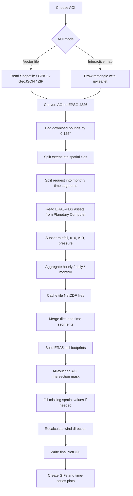
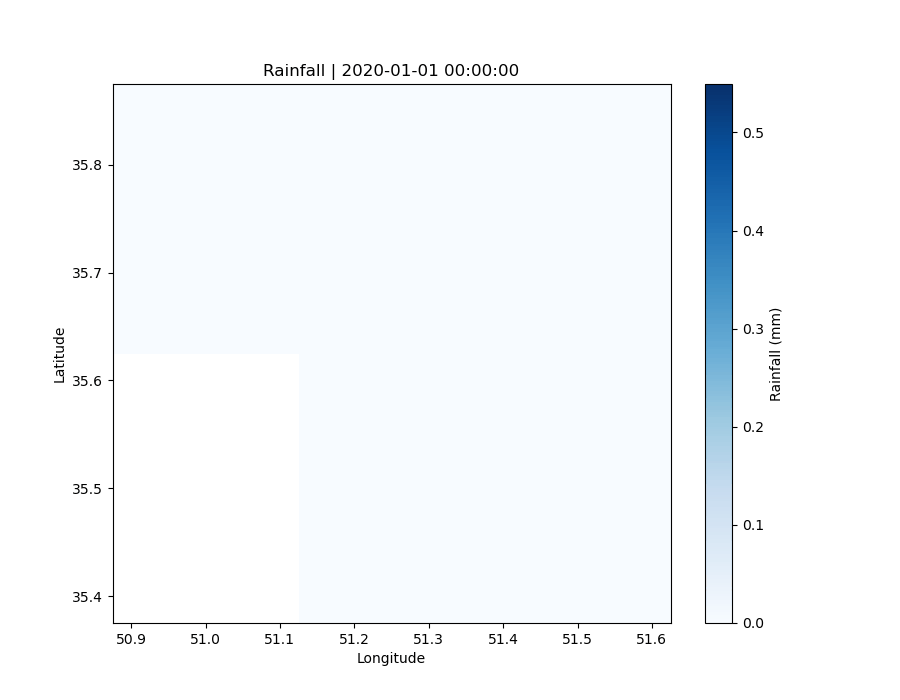
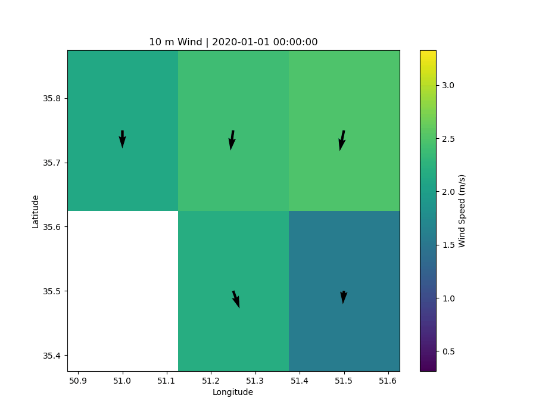
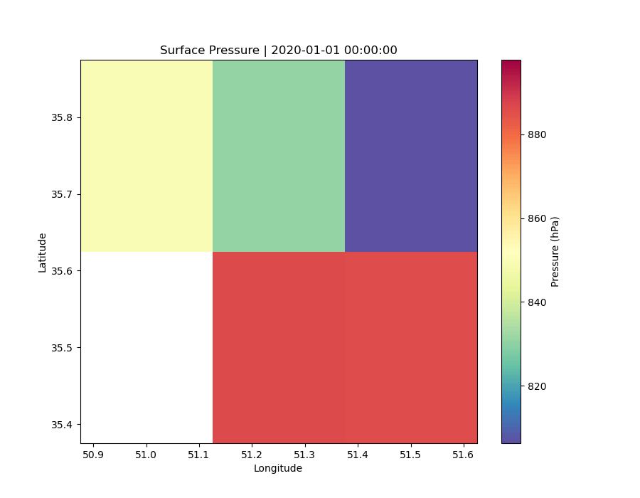

# ERA5 Rainfall, Wind & Surface Pressure Downloader

<p align="center">
  <strong>Download, clip, aggregate, quality-check, visualize, and export ERA5 weather data to NetCDF for a vector or interactive Area of Interest (AOI).</strong>
</p>

<p align="center">
  
  
  
  
</p>

---

## Overview

This Jupyter Notebook downloads **ERA5-PDS** weather data from the **Microsoft Planetary Computer**, subsets it in space and time, applies an exact vector AOI mask, fills spatial gaps when necessary, and exports a standard NetCDF file.

The notebook supports:

- **Rainfall / precipitation**
- **10 m eastward wind component (`u10`)**
- **10 m northward wind component (`v10`)**
- **10 m wind speed**
- **Meteorological wind direction**
- **Surface pressure**
- **Hourly, daily, or monthly output**
- **Vector AOIs** from Shapefile, GeoPackage, GeoJSON, or ZIP
- **Interactive rectangle AOIs** using `ipyleaflet`
- **Spatial tiling and local cache**
- **All-touched AOI masking**
- **Nearest-valid-neighbor spatial filling**
- **NetCDF output**
- **Animated rainfall, wind, and pressure maps**
- **AOI-mean time-series plots**

> **Important:** this version intentionally preserves ERA5 grid cells whose **cell footprint intersects or touches the AOI boundary**. It does **not** rely only on whether the grid-cell center falls inside the polygon.

---

## Why the All-Touched Boundary Mask Matters

A common clipping approach tests only the center coordinate of every ERA5 grid cell. That can remove a cell even when part of the cell overlaps the study area.

This notebook instead constructs the **actual footprint of every ERA5 grid cell** and evaluates:

```python
intersects(cell_footprint, AOI_geometry)
```

Therefore a grid cell is retained when:

- its center is inside the AOI,
- only part of the cell lies inside the AOI,
- the AOI boundary crosses the cell, or
- the cell only touches the AOI boundary.

The download extent is also padded by **half of one ERA5 grid cell**:

```python
ERA5_GRID_DEG = 0.25
EDGE_PAD_DEG = ERA5_GRID_DEG / 2.0   # 0.125°
```

This is important because a boundary-intersecting cell may have its center just outside the raw vector bounding box. Padding prevents that cell from being excluded before the exact AOI mask is applied.

---

## Workflow



---

## Data Source

The notebook uses the `era5-pds` collection exposed through the Microsoft Planetary Computer STAC API.

Configured source window in this notebook:

```text
1979-01-01 00:00  →  2020-12-31 23:00
```

Requests outside this interval are rejected by the notebook configuration.

The cloud data are accessed as Zarr-backed ERA5-PDS assets and written locally as compressed NetCDF files.

---

## Variables

| Output variable | Description | Units |
|---|---|---|
| `rainfall_mm` | Total / accumulated precipitation | mm |
| `u10` | 10 m eastward wind component | m s⁻¹ |
| `v10` | 10 m northward wind component | m s⁻¹ |
| `wind_speed` | 10 m wind speed | m s⁻¹ |
| `wind_direction` | Meteorological wind direction | degree |
| `surface_pressure_hpa` | Surface pressure | hPa |

### Wind speed

Wind speed is calculated from the two horizontal wind components:

\[
V = \sqrt{u_{10}^{2} + v_{10}^{2}}
\]

### Wind direction

Meteorological wind direction is calculated as:

\[
D = \left(270 - \operatorname{atan2}(v_{10}, u_{10})\frac{180}{\pi}\right)\bmod 360
\]

---

## Temporal Aggregation

Set:

```python
TIME_MODE = "hourly"
```

Supported values are:

| Mode | Rainfall | Wind components | Pressure | Wind speed |
|---|---|---|---|---|
| `hourly` | Original hourly values | Original | Original | Derived hourly |
| `daily` | Sum | Mean | Mean | Mean |
| `monthly` | Sum | Mean | Mean | Mean |

For daily and monthly output, wind direction is calculated from the aggregated mean `u10` and `v10` vector.

---

## Installation

Run the notebook installation cell:

```python
%pip install -q xarray "zarr<3" dask adlfs h5netcdf netCDF4 \
    pystac-client planetary-computer geopandas shapely pyproj scipy \
    ipyleaflet ipywidgets matplotlib pandas tqdm
```

The notebook is designed for Jupyter environments and also includes support for Google Colab's custom widget manager when available.

---

## Configuration

The main configuration block is:

```python
MODE = "shapefile"
SHAPEFILE_PATH = ""

START_DATE = "2020-01-01 00:00"
END_DATE = "2020-01-31 23:00"
TIME_MODE = "hourly"

SPATIAL_TILE_DEG = 2.0
ERA5_GRID_DEG = 0.25

OUTPUT_DIR = Path("./ERA5_weather")
CACHE_DIR = OUTPUT_DIR / "cache"
OUTPUT_NAME = None
```

### Main options

| Setting | Purpose |
|---|---|
| `MODE` | `"shapefile"` or `"map"` |
| `SHAPEFILE_PATH` | Vector AOI path |
| `START_DATE` | First requested timestamp |
| `END_DATE` | Last requested timestamp |
| `TIME_MODE` | `"hourly"`, `"daily"`, or `"monthly"` |
| `SPATIAL_TILE_DEG` | Tile width/height in degrees |
| `ERA5_GRID_DEG` | ERA5 grid spacing used for edge padding |
| `OUTPUT_DIR` | Final output directory |
| `CACHE_DIR` | Local cache directory |
| `OUTPUT_NAME` | Optional custom NetCDF filename |

---

## AOI Option 1 — Vector File

Set:

```python
MODE = "shapefile"
```

The reader supports:

- ESRI Shapefile
- GeoPackage
- GeoJSON
- ZIP archives readable by GeoPandas

You can either set the path directly:

```python
SHAPEFILE_PATH = r"D:\ShapeFiles\my_aoi.shp"
```

or leave it empty:

```python
SHAPEFILE_PATH = ""
```

and enter the path when the notebook prompts for it.

### CRS handling

The vector layer:

1. must contain valid geometry,
2. must have a defined CRS,
3. is converted to **EPSG:4326**, and
4. is dissolved into one AOI geometry before the ERA5 mask is built.

---

## AOI Option 2 — Interactive Map

Set:

```python
MODE = "map"
```

An `ipyleaflet` map is displayed. Draw a rectangle to define the AOI.

The selected rectangle geometry and bounds are then used by the same downstream pipeline as a vector AOI.

---

## Spatial Tiling

Large requests are divided into geographic tiles:

```python
SPATIAL_TILE_DEG = 2.0
```

Each tile is downloaded and written to the cache separately.

Example tile ID:

```text
r000_c000
```

This approach makes the workflow easier to resume and avoids repeatedly downloading already completed tiles.

---

## Monthly Request Segments

Even when the requested period spans several months, the notebook processes the request month-by-month.

Example:

```text
2020-01  2020-01-01 00:00:00  ->  2020-01-31 23:00:00
```

Each monthly segment uses the relevant ERA5-PDS analysis and forecast STAC items.

---

## ERA5 Assets Used

### Analysis variables

```python
ANALYSIS_VARS = {
    "u10": "eastward_wind_at_10_metres",
    "v10": "northward_wind_at_10_metres",
    "surface_pressure_hpa": "surface_air_pressure",
}
```

### Forecast variable

```python
FORECAST_VARS = {
    "rainfall_mm": "precipitation_amount_1hour_Accumulation",
}
```

Conversions applied by the notebook:

- surface pressure: **Pa → hPa**
- precipitation: source value × **1000 → mm**

---

## All-Touched AOI Implementation

After all tiles are merged, coordinate edges are reconstructed from ERA5 cell centers.

For longitude:

```python
lon_edges = coordinate_edges(weather.lon.values)
```

For latitude:

```python
lat_edges = coordinate_edges(weather.lat.values)
```

The notebook then creates one polygonal footprint per grid cell:

```python
CELL_FOOTPRINTS = shapely_box(
    lon_edges[:-1][None, :],
    lat_edges[:-1][:, None],
    lon_edges[1:][None, :],
    lat_edges[1:][:, None]
)
```

The mask is calculated with exact geometry intersection:

```python
AOI_MASK = np.asarray(
    intersects(CELL_FOOTPRINTS, AOI_GEOM),
    dtype=bool
)
```

Finally:

```python
weather = weather.where(AOI_MASK_DA)
```

This keeps the rectangular `lat × lon` coordinate envelope in the NetCDF while values outside the all-touched AOI mask remain `NaN`.

---

## Missing-Data Handling

The notebook checks these variables:

```python
BASE_FILL_VARS = [
    "rainfall_mm",
    "u10",
    "v10",
    "surface_pressure_hpa",
    "wind_speed",
]
```

For each time step independently:

1. missing values inside the AOI are detected,
2. the closest spatially valid grid cell is found using `scipy.ndimage.distance_transform_edt`,
3. missing values are filled from that nearest valid cell,
4. values outside the AOI mask remain `NaN`.

Wind direction is then recalculated from the final `u10` and `v10`.

A CSV report is saved as:

```text
missing_data_report.csv
```

---

## Cache Logic

The cache directory is keyed by a SHA-1 hash of the run configuration.

The hash includes:

- padded download bounds,
- original AOI bounds,
- start time,
- end time,
- temporal mode,
- tile size,
- AOI-mask strategy.

The mask identifier used by this version is:

```text
all_touched_cell_intersection
```

This prevents cache files produced by a different AOI-mask strategy from being silently reused.

---

## Final NetCDF Metadata

The output dataset stores metadata including:

```text
title
source
temporal_resolution
requested_start
requested_end
spatial_resolution
aoi_bounds_wgs84
aoi_mask
missing_fill
```

The AOI mask metadata explicitly records:

```text
all-touched grid-cell footprint intersection; boundary cells retained
```

---

# Example Run Included in the Notebook

The uploaded executed notebook contains a real example using a Tehran vector AOI.

### AOI

```text
AOI bounds:
(51.089009877030186,
 35.56821728644368,
 51.6060783395989,
 35.828524579904695)
```

### Half-cell padded download bounds

```text
(50.964010,
 35.443217,
 51.731078,
 35.953525)
```

### Request period

```text
2020-01-01 00:00:00
to
2020-01-31 23:00:00
```

### Temporal mode

```text
hourly
```

### Spatial tiles

```text
1 tile
r000_c000
```

### Merged coordinate envelope

```text
time: 744
lat:  2
lon:  3
```

Coordinates:

```text
Latitude:  35.50 → 35.75
Longitude: 51.00 → 51.50
```

### All-touched result

```text
AOI grid cells retained: 5
```

This means the final coordinate envelope is `2 × 3 = 6` possible grid positions, while **5 ERA5 cell footprints intersect the vector AOI and are retained by the all-touched mask**.

### Missing-data report

| Variable | Missing before | Missing after |
|---|---:|---:|
| `rainfall_mm` | 0 | 0 |
| `u10` | 0 | 0 |
| `v10` | 0 | 0 |
| `surface_pressure_hpa` | 0 | 0 |
| `wind_speed` | 0 | 0 |

### Example final file

```text
ERA5_rain_wind_pressure_hourly_2020010100_2020013123.nc
```

Reported size in the notebook:

```text
0.09 MB
```

---

# Visual Outputs

The following animations were extracted directly from the executed notebook output.

## Rainfall

<p align="center">
  
</p>

The animation displays `rainfall_mm` through time over the masked AOI grid.

---

## 10 m Wind

<p align="center">
  
</p>

The wind animation combines:

- shaded **wind speed**, and
- quiver arrows from `u10` and `v10`.

---

## Surface Pressure

<p align="center">
  
</p>

The animation displays `surface_pressure_hpa` through time.

---

## AOI-Mean Time Series

The notebook also contains code to calculate and plot spatially averaged time series for:

- mean rainfall,
- mean wind speed,
- mean surface pressure.

Example calculation:

```python
spatial_dims = ("lat", "lon")

rain_ts = ds["rainfall_mm"].mean(spatial_dims, skipna=True)
wind_ts = ds["wind_speed"].mean(spatial_dims, skipna=True)
pressure_ts = ds["surface_pressure_hpa"].mean(spatial_dims, skipna=True)
```

---

# Output Structure

A typical run creates:

```text
ERA5_weather/
├── cache/
│   └── <run_hash>/
│       ├── <month>_<tile>_<mode>.nc
│       └── ...
├── gifs/
│   ├── rainfall_<mode>.gif
│   ├── wind_<mode>.gif
│   └── pressure_<mode>.gif
├── ERA5_rain_wind_pressure_<mode>_<start>_<end>.nc
└── missing_data_report.csv
```

---

## Reading the Final NetCDF

Use `xarray`:

```python
import xarray as xr

ds = xr.open_dataset(
    "ERA5_weather/ERA5_rain_wind_pressure_hourly_2020010100_2020013123.nc"
)

print(ds)
```

Select one timestamp:

```python
sample = ds.sel(time="2020-01-15 12:00")
```

Plot rainfall:

```python
sample["rainfall_mm"].plot()
```

Plot wind speed:

```python
sample["wind_speed"].plot()
```

Compute an AOI spatial mean:

```python
mean_pressure = ds["surface_pressure_hpa"].mean(
    dim=("lat", "lon"),
    skipna=True
)
```

Close the dataset when finished:

```python
ds.close()
```

---

## NetCDF Naming

When `OUTPUT_NAME = None`, filenames are generated automatically:

```text
ERA5_rain_wind_pressure_<TIME_MODE>_<START>_<END>.nc
```

Example:

```text
ERA5_rain_wind_pressure_hourly_2020010100_2020013123.nc
```

---

## Notes on the Rectangular NetCDF Grid

The final NetCDF retains regular one-dimensional `lat` and `lon` coordinates.

Because an arbitrary vector AOI is not necessarily rectangular:

- cells that intersect the AOI contain weather values,
- cells outside the AOI contain `NaN`,
- boundary-intersecting cells remain valid because of the all-touched mask.

This preserves a standard gridded NetCDF structure while still respecting the vector geometry.

---

## Error Checks Included

The notebook validates several conditions before or during processing:

- `TIME_MODE` must be `hourly`, `daily`, or `monthly`,
- `START_DATE <= END_DATE`,
- request dates must lie within the notebook's configured source interval,
- vector files must exist,
- vector data must not be empty,
- vector data must have a CRS,
- AOI geometry must not be empty,
- AOI bounds must be geographically valid,
- ERA5 STAC items must exist,
- required STAC assets must exist,
- at least one ERA5 tile must be downloaded,
- at least one monthly dataset must be merged.

---

## Reproducibility

For reproducible runs, keep track of:

- AOI vector file,
- AOI CRS,
- start and end timestamps,
- `TIME_MODE`,
- `SPATIAL_TILE_DEG`,
- `ERA5_GRID_DEG`,
- notebook version,
- cache state.

The final NetCDF stores the requested date range, AOI bounds, temporal resolution, source description, spatial resolution, mask strategy, and missing-value filling strategy in its global attributes.

---

## Notebook File

Main notebook:

```text
ERA5_weather_downloader_v2_all_touched_boundary.ipynb
```

Recommended GitHub layout:

```text
your-repository/
├── README.md
├── ERA5_weather_downloader_v2_all_touched_boundary.ipynb
└── assets/
    ├── rainfall_hourly.gif
    ├── wind_hourly.gif
    └── pressure_hourly.gif
```

With this layout, the image paths used in this README work directly on GitHub.

---

## Summary

This workflow is useful when you need an ERA5 NetCDF clipped to a vector AOI **without losing edge cells**.

The key behavior of this version is:

```text
Keep every ERA5 grid cell whose footprint intersects the AOI geometry.
```

That includes cells crossed by or touching the polygon boundary, making the spatial subset more appropriate for analyses where boundary coverage matters.
